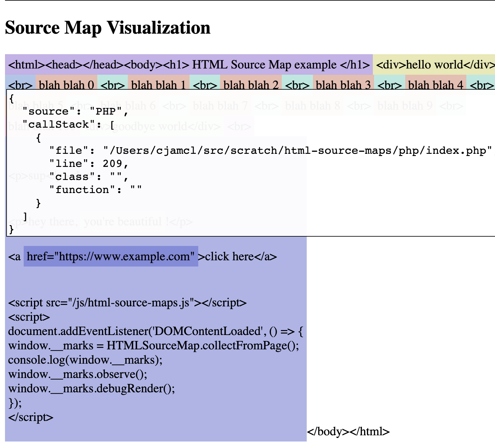

## First idea

Collect all mappings of html fragments generated on the server, and at the end of the request emit a script tag with the JSON'ified data.

Data looks like this:
```
{
  "frames": [
    {
      "file": "/Users/cjamcl/src/scratch/html-source-maps/php/index.php",
      "line": 137,
      "function": "print",
      "class": "View"
    },
    {
      "file": "/Users/cjamcl/src/scratch/html-source-maps/php/index.php",
      "line": 138,
      "function": "sayHi",
      "class": "View"
    },
    {
      "file": "/Users/cjamcl/src/scratch/html-source-maps/php/index.php",
      "line": 139,
      "function": "print",
      "class": "View"
    }
  ],
  "mappings": [
    {
      "callStack": [
        0
      ],
      "len": 35
    },
    {
      "callStack": [
        1
      ],
      "len": 22
    },
    {
      "callStack": [
        2
      ],
      "len": 5
    },
  ],
  "output": " <h1> HTML Source Map example </h1><div>hello world</div> <br>blah blah 0 <br>blah blah 1 <br>blah blah 2 <br>blah blah 3 <br>blah blah 4 <br>blah blah 5 <br>blah blah 6 <br>blah blah 7 <br>blah blah 8 <br>blah blah 9 <br>blah blah 100<div>goodbye world</div> <br>"
}
```

The numbers in mappings[].callStack are indices into frames.
mappings[].len is how long of an HTML fragment this function call generated.
output is the entire server response, stored here so that the client can access the un-modified HTML.

This seems fine enough for understanding the HTML that comes out of a server. See commit ad26e8 for working example.


However, in order to also map changes to the DOM via JS during runtime, this approach is lacking.

Browsers will actually "spruce up" the HTML it gets to be well-formed. This is well defined in the spec. For example, if the server provides just `<h1>Hello<h1>`, Chrome will actually parse it as `<html><head></head><body><h1>Hello<h1></body></html>` (as seen via reading `document.documentElement.outerHTML`). This invalidates the "len" property in the mapping data above - so, no additional mappings originating from runtime can be added while persisiting the server mappinngs, without a huge headache (reaching into Chrome's HTML parser? recreating it in JS? ugh...).

## Another way

Instead of collecting all the mappings on the server and spitting it out in a script data tag - each mapping can be emitted as an HTML comment as-it-happens. Each magic comment will break up the HTML into the same segments as in the first approach, but the data will be embedded right next to the fragment it represents. Any augmentations from the browser will not break the mappings, b/c they no do not rely on an offset.



